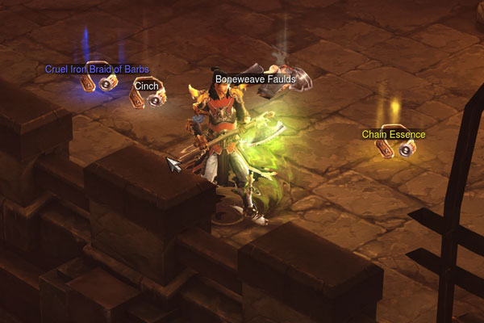
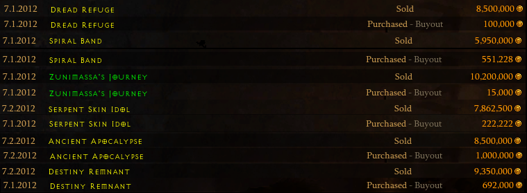
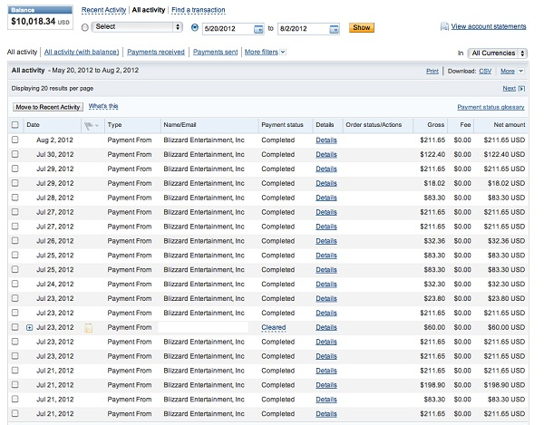

Multiplayer online RPGs are largely driven by the player's ability to obtain powerful items through _farming_, the process of repeatedly going through the same set of tasks to accumulate some specific set of resources or wealth. The [farming black market](https://web.archive.org/web/20221003103111/https://www.eurogamer.net/world-of-warcraft-and-the-battle-against-black-market-gold) is estimated to take 85% of the $3bn gaming services industry.

<figcaption class="mb-8 mt-0 text-sm text-center text-gray-500 dark:text-gray-400">Loot drops can trigger a <a href="http://www.psychologyofgames.com/2012/06/the-psychology-of-diablo-iii-loot-part-3-dopamine-binds-on-pickup/" target="_blank">dopamine release</a></figcaption>

Diablo 3, an action RPG by Blizzard Entertainment, introduced the _real-money auction house_ to combat gold farming, allowing players to trade virtual goods for real money through a legitimate in-game system. My friends and I initially made money by optimizing characters for farming rare items. However, we soon discovered that flipping underpriced items on the auction house was far more profitable.

We developed spreadsheets and scripts to automate the process, competing with other botters for valuable items. Seeking a better solution, I created "Deckard Coin," a bot that could operate multiple game clients simultaneously and quickly execute complex searches. Our group was making over $15,000 per week combined. We expanded operations, buying new game copies to replace banned accounts and using prepaid phones to verify multiple accounts.

<figcaption class="mb-8 mt-0 text-sm text-center text-gray-500 dark:text-gray-400">Simple: buy low, sell high</a></figcaption>

Despite advice against it, I decided to sell licenses to Deckard Coin publicly. Within days of launching, I received a cease and desist from Blizzard's VP of Legal Affairs. They demanded we remove all traces of the bot or face severe legal consequences. Fighting a billion-dollar corporation wasn't something I was willing to attempt so I took down all traces of Deckard Coin and continued to use it for personal gain.

<figure class="w-full flex flex-col items-center justify-center">
  <iframe class="h-auto max-w-full rounded-lg aspect-video h-96 mb-4" src="//www.youtube.com/embed/H-ZRnsiEpu8" frameborder="0" allowfullscreen></iframe>
  <figcaption class="mt-4 text-sm text-center text-gray-500 dark:text-gray-400">Deckard Coin in action</figcaption>
</figure>

In just two months, most of us had made around $20,000 from the auction house. While profitable, managing the operation was time-consuming and stressful. Blizzard eventually shut down the RMAH and disabled trading to address the game's economic issues.

<figcaption class="mt-0 mb-8 text-sm text-center text-gray-500 dark:text-gray-400">Blizzard paid out directly to your PayPal account</figcaption>

This experience was a unique confluence of factors: a popular game, poorly designed systems, and a misguided attempt to legitimize virtual good sales. While I don't miss it, it was an interesting chapter in gaming history.
