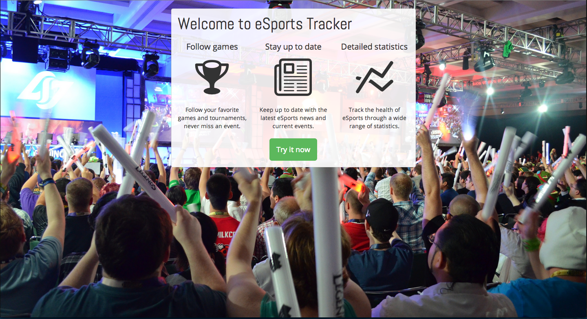
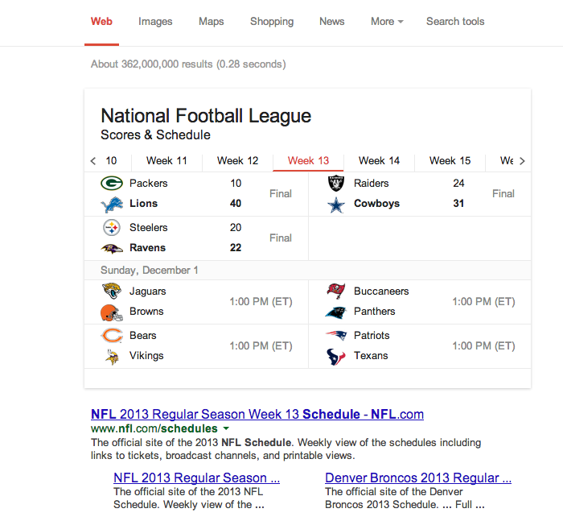

eSports Tracker is a webapp that aims to streamline the spectating experience for competitive video games. Users can follow their favorite games and access a personalized dashboard that shows what's happening in the competitive scene at a glance. Take a look at [this blog post](/blog/tracking-esports-part-1) to read more or just click the link below to check it out.

[Esports](http://en.wikipedia.org/wiki/Electronic_sports) (competitive video gaming) has been pretty big in [South Korea](http://en.wikipedia.org/wiki/Korean_e-Sports_Association) for a while. The industry was worth [$1.2 billion](http://esportsdigest.com/starcraft-2/editorial-the-legitimacy-of-esports-and-the-dreamhack-open-2013/) in Korea alone last year. They have multiple cable [TV](http://en.wikipedia.org/wiki/Ongamenet) [channels](http://en.wikipedia.org/wiki/MBCGame) dedicated to watching other people play video games, and talented players often make [six figure salaries](http://www.businessinsider.com/a-look-inside-the-earnings-of-a-top-ranked-professional-starcraft-ii-player-2012-6). Esports is also starting to grow in both the US and Europe thanks to game developers like [Riot](http://www.riotgames.com/), [Valve](http://www.valvesoftware.com/), and [Blizzard](http://us.blizzard.com/en-us/) investing their own money into big tournaments like the [League Championship Series](http://competitive.na.leagueoflegends.com/article/season-3-league-legends-championship-series), [The International](http://www.dota2.com/international/home/overview/), and the [World Championship Series](http://wcs.battle.net/sc2/en). Combined with these official venues, tournaments like [GSL](http://wiki.teamliquid.net/starcraft2/GOMTV_Global_StarCraft_II_League), [DreamHack](http://www.dreamhack.se/splash/), [WCG](http://us.wcg.com/), and other various events award millions of dollars every year to the best teams and players.

Starcraft II: HotS had [more than 150 events](http://wiki.teamliquid.net/starcraft2/Premier_Tournaments) this past year and that's not even counting the weekly/monthly tournaments that happen regularly. Other major games like League of Legends and Dota 2 see a similar number of events which creates quite an active competitive scene. So where does this leave the average spectator? It's tough to keep up with one game, let alone 2 or more. [Twitch](http://www.twitch.tv/), a streaming service for gaming, is about the closest thing we have right now to a centralized place for tournaments but their interface is not designed for keeping track of events, and just lists streams in their order of popularity. There are a couple websites, like the [Team Liquid calendar](http://www.teamliquid.net/calendar/‎) for StarCraft and the [EsportsCalendar](http://esportcalendar.com/) for League of Legends, but many competitive games don't have such services; not to mention I have to check a different website for every game that I want to watch.

I'm fond of the notion that you should [work on a problem you experience yourself](http://paulgraham.com/startupideas.html). So I'm creating a service that aggregates all tournament information in one place, for **all** games. Users can 'follow' their favorite games, tournaments, teams, or players to gain access to a personal feed of just the information they want. Instead of slogging through various calendar sites and filtering out the uninteresting events you will have just the important stuff in a clean, simple format. The development of this project, which I'm currently calling 'eSports Tracker', is still underway but if you want more details feel free to contact me. In my next post I'll talk about the various features of eSports Tracker (seriously I need a better name, let me know if you think of one!) including stat tracking and the promotion of less popular games.

In my [last post](/blog/tracking-esports-part-1/) I introduced eSports Tracker as a tool for keeping up-to-date with the latest eSports events. In this post I'll talk more about the roadmap for eSports Tracker and some of the other features I'm excited to work on.

The first goal of eSports Tracker is to provide a single, clean page that tells you everything you need to know for the current week. If you don't follow competitive sports you may not realize this already exists for things like the NFL, NBA, and MLB. As I'm writing this post the NFL season is underway. Try googling ["nfl schedule"](https://www.google.com/search?q=nfl+schedule) to see what I mean:

I don't even have to click on a search result to find the information I'm looking for. On top of that, the very first result is exactly what I wanted in the first place. This is the kind of tool I want for eSports and the primary motivation behind this project. As soon as I can glance at a page and know within a matter of seconds what I'm going to watch in the next few days I'll know I'm on the right track.

I'm also interested in 'big picture' stats. There are [great](http://dotabuff.com/) [websites](http://www.lolking.net/) that track detailed statistics about hero picks, matchup stats, item trends, and much more. These 'micro' statistics are interesting in the short term but have little utility several months after the fact. I want to track statistics like average prize pools, number of tournaments, and tournament regions. Combined with temporal data, I want to be able to track the relative health of competitive games. For example, the amount of money earned in Dota 2 vs. League of Legends in the past 3 months or total SC2 prizes earned in Korea vs. North America. Given only a few different statistics, we can see how games are trending over time and we can compare games to each other.

Another problem I'd like to tackle is the promotion of smaller games. As I mentioned in part 1, the only central place to find tournament streams is Twitch.tv, but their interface favors games that are already popular. For example, there's a big Super Smash Bros. Melee tournament happening as I write this (the "world's largest" according to the stream) but only 1200 people are watching it making it the 17th most popular game on Twitch. If I hadn't been exploring the bottom half of Twitch's streams page I wouldn't have known that one of the biggest competitive events for an interesting game that is happening right now. With the data that eSports Tracker collects, we will have the ability to promote small games that are having their big events since we'll be able to analyze statistics like prize pool variance and the number of events per year. For example, if SSB:M has several $250 prize pool tournaments, and only one $5,000 prize pool tournament, we can assume that is a pretty big event for them and notify our users that an interesting tournament is currently going on that they might want to watch.

In the next post I'll talk about some of the challenges so far in implementing eSports tracker such as API integration, leveraging user input, and designing a clean interface that provides an awesome user experience.
