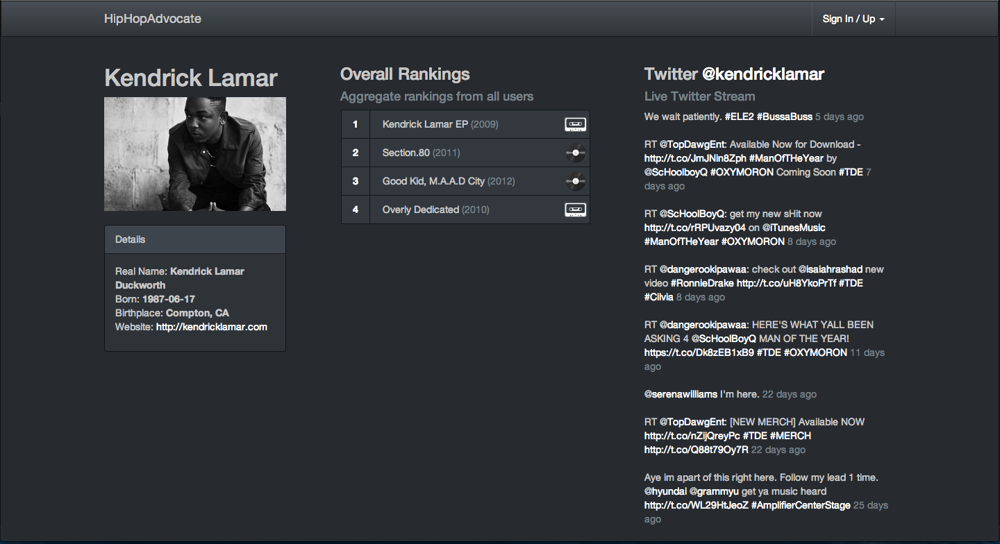

The hip-hop industry is unique in that so much music gets released for free in the form of mixtapes and sometimes this free music is even better than some of the studio albums. The problem is that, when browsing through an artist on Spotify or iTunes, all you typically see are these official studio releases.

RapAdvocate is meant to provide a single source for seeing an artist's full discography, lets users rank these albums and mixtapes from best to worst, and aggregates everyone's rankings into one list. It serves as a lightweight music discovery tool (as opposed to bloated sites like last.fm) that is tailored to the hip hop community.

I started this side project to learn the [Meteor](http://www.meteor.com/) framework. It features a live aggregate of album rankings through users, as well as a live Twitter feed from the artist.
